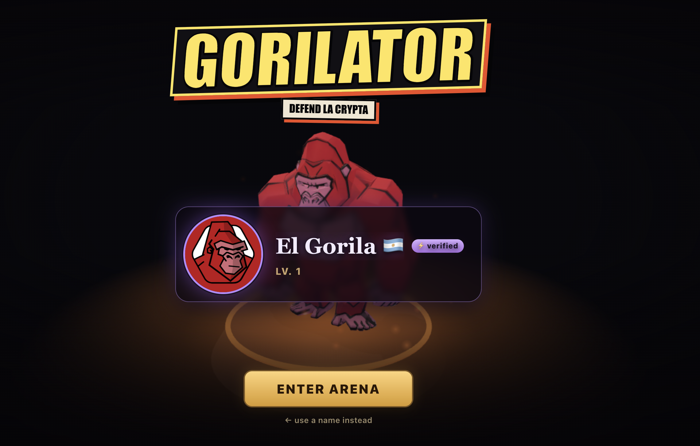
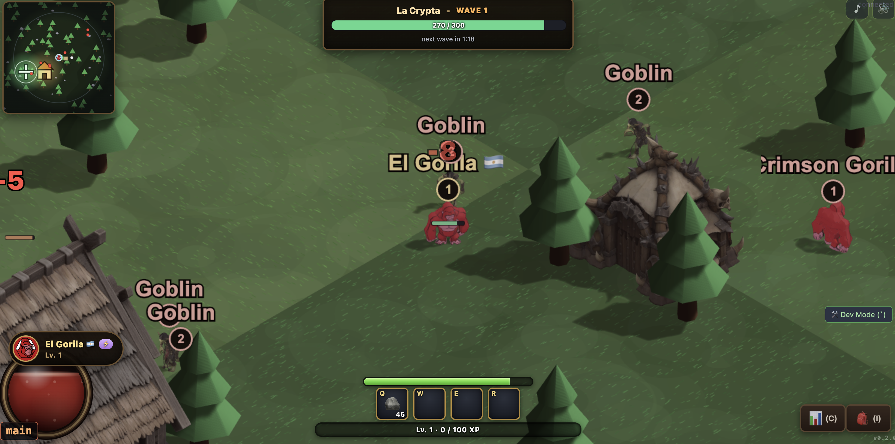
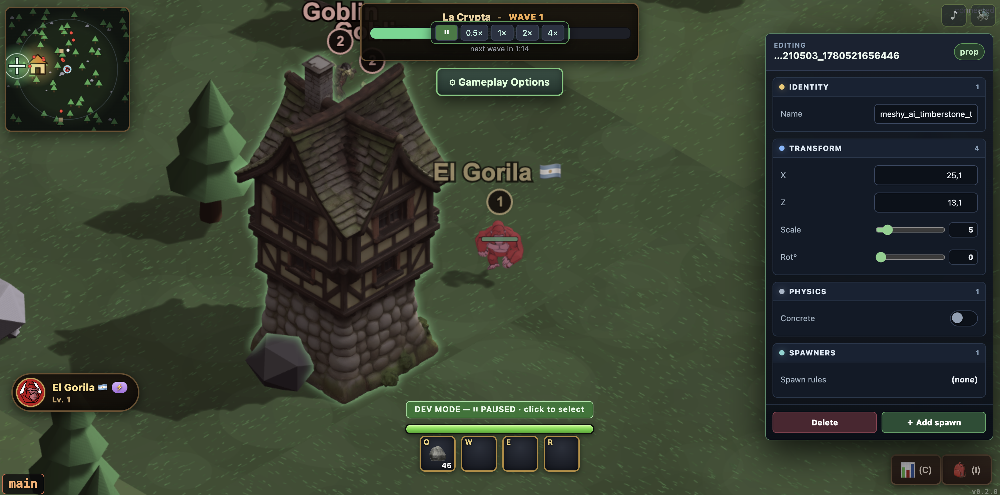

<div align="center">

# 🦍 GORILATOR

### Defend La Crypta.

**An open-source online multiplayer RPG tower-defense — with the game-dev SDK built right into the game.**

[](https://github.com/agustinkassis/gorilator-rpg)
[](#license)
[](https://www.babylonjs.com)
[](https://colyseus.io)
[](https://nostr.com)

[**▶ Play now**](https://game.gorilator.io) · [Live servers](https://gorilator.io/stats.html) · [Docs](docs/README.md) · [Self-host](DEPLOY.md)



</div>

---

## What is Gorilator?

Gorilator is a **multiplayer isometric RPG tower defense**. Pick a warrior, drop into a shared realm with other players, and hold **La Crypta** against waves of enemies — looting, crafting, and leveling as you go. Open two tabs (or invite friends to your server) and you'll see everyone move and fight in real time.

But the twist is what's *inside* the game: Gorilator ships a **developer SDK and world editor baked into the running client**. You don't clone a separate tool — you flip on Dev Mode, place props, import 3D models from the UI, define new items and entities, and **commit your changes from within the game itself**. Building the game and playing the game happen in the same window.

It's early and under active development — and intentionally **easy to contribute to**.

<div align="center">



*Isometric multiplayer combat — hold La Crypta against the waves with other players in real time.*

</div>

---

## ⚡ Quick start — play in 5 minutes

Run your own realm natively (no Docker). Three steps:

```bash
# 1. Bootstrap on a bare box (installs Node, git, deps, then the game)
curl -fsSL https://raw.githubusercontent.com/agustinkassis/gorilator-rpg/main/cli/install.sh | sudo bash

# 2. ...or, if you already have Node ≥ 20.6:
npx gorilator install

# 3. Manage everything with the global CLI
gorilator setup       # interactive: ports, server key, Cloudflare public domain
```

The installer clones the game, builds it, generates a `.env` (including the server's Nostr signing key), and registers a **boot-persistent service** (systemd on Linux, launchd on macOS). When it's done it prints your local URL and monitor credentials.

After that, the global `gorilator` command supervises the daemon from anywhere:

```bash
gorilator status      # service state + health + local & public URLs
gorilator start       # start the service
gorilator stop        # stop the service
gorilator restart     # restart the service
gorilator logs -f     # follow logs
gorilator update      # git pull, rebuild, restart
gorilator setup       # ports, server NSEC, Cloudflare tunnel, env
```

`gorilator setup` can put your realm online on **your own subdomain** (`game.<yourdomain>`) through a Cloudflare Tunnel — anyone can run a server. Full details in **[DEPLOY.md](DEPLOY.md)**.

> Prefer containers? A **Docker Compose** stack and a one-click **[Railway](RAILWAY.md)** template ship in the repo too.

---

## 🛠️ Build the game from inside the game

Gorilator's developer SDK lives in the client (`packages/client/src/dev/`). Toggle **Dev Mode** in the running game and you can:

| In-game tool | What it does |
|--------------|--------------|
| 🗺️ **World / map editor** | Select, move, and place props directly in the scene. Layouts persist back to `props.json` via Vite dev endpoints. |
| 📦 **Upload 3D models from the UI** | Import glTF/GLB models straight from the browser — no file juggling. |
| ⚔️ **Create items & entities** | Define new items, characters, and entities through the in-game libraries (Item Library, Prop Library, Character Manager). |
| 🎞️ **Animation tester & inspector** | Preview animation state machines (idle / walk / attack / hit / death) and inspect live entities. |
| ✅ **Commit system** | Persist your edits from within the game — develop the game *as you play it*. |

This makes content creation approachable: artists and designers can contribute models, props, and entities without touching the engine internals.

<div align="center">



*Dev Mode: select an entity and edit identity, transform, physics, and spawners — live, in the running game.*

</div>

---

## 🎮 Core systems

- **Tower defense** — hold the house, break the waves.
- **RPG progression** — level up, loot, and craft.
- **Online multiplayer** — server-authoritative Colyseus rooms with automatic state sync.
- **Crafting & resource pickups** — gather and build.
- **Nostr identity** — log in with your Nostr key to keep your player progress across realms. Your save is signed by the server's Nostr key, so progress follows you.
- **Run your own server** — every realm is self-hostable; discover servers via the [live dashboard](https://gorilator.io/stats.html).

---

## 🧱 Tech stack

| Layer | Tech |
|-------|------|
| Render engine | **Babylon.js** (3D, orthographic isometric camera) |
| Multiplayer | **Colyseus** (authoritative rooms, automatic state sync) |
| Server | **Node.js** + **Express** |
| Identity | **Nostr** |
| Language / build | **TypeScript** + **Vite** |
| Monorepo | **pnpm** workspaces |

```
packages/
  shared/    @rpg/shared   — Colyseus schema + types + constants (client AND server)
  server/    @rpg/server   — authoritative game server (default port 2567)
  client/    @rpg/client   — Babylon.js + Vite browser client + in-game dev SDK
  landing/   @gorilator/landing — marketing site + live server dashboard
  cli/       gorilator     — native installer / supervisor CLI
```

**Server-authoritative by design:** clients send only intents (`move {x,z}`, `attack {targetId}`). The server runs a 20 Hz simulation tick, owns positions / HP / animation-state, and syncs via `@colyseus/schema`. Clients interpolate remote entities and drive animations from synced state.

---

## 💻 Develop locally

```bash
pnpm install
pnpm dev          # starts server + client together
```

Then open the client URL printed by `pnpm dev` (default <http://localhost:5173>). The live room-state inspector is at the monitor URL (default <http://localhost:2567/colyseus>).

- **Left-click the ground** → your warrior walks there.
- **Left-click an enemy** → approach and attack; target takes damage, dies, respawns.
- **Open a second tab** → a second player appears and syncs in real time.
- **Toggle Dev Mode** → edit the world, import models, and create entities live.

---

## 🤝 Contributing

Gorilator is under active development and built to be easy to jump into:

- **Content** (models, props, items, entities) → use the **in-game dev SDK** above. No engine knowledge needed.
- **Game logic** → it's all TypeScript in `packages/`, with shared schema imported by both client and server.
- **Docs** → live in [`docs/`](docs/README.md): [getting started](docs/getting-started.md), [architecture](docs/architecture.md), [gameplay](docs/gameplay.md), [entities](docs/entities.md), [configuration](docs/configuration.md), [Nostr events](docs/nostr.md).

Fork it, run `pnpm dev`, make a change, and open a PR. Server/realm discovery for external apps is documented in [REALMS.md](REALMS.md).

---

## 📚 Documentation

- [Getting started](docs/getting-started.md)
- [Architecture & structure](docs/architecture.md)
- [Game dynamics](docs/gameplay.md)
- [Entities & objects](docs/entities.md)
- [Configuration & tuning](docs/configuration.md)
- [Nostr events](docs/nostr.md)
- [Self-hosting](DEPLOY.md) · [Railway](RAILWAY.md) · [Realms / discovery](REALMS.md)

---

## License

**MIT** — 100% open source. Build, host, fork, and contribute freely.

<div align="center">

[**▶ Play Gorilator**](https://game.gorilator.io) · [Star on GitHub](https://github.com/agustinkassis/gorilator-rpg) · [Run your own realm](DEPLOY.md)

🦍 *Defend La Crypta.*

</div>
